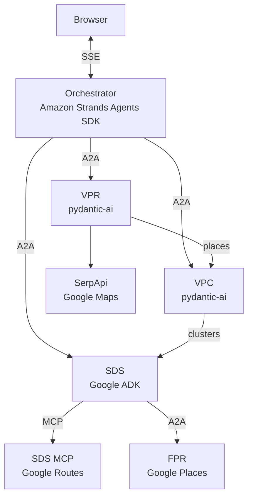

# Polimi Cloud Computing — Multi-Agent Travel Planner

A multi-agent travel planner that turns a natural-language request into a **day-by-day itinerary** with attractions, travel legs, and lunch recommendations.

Example request:

> Plan a 2-day trip to Milan, I like history and food, mid budget, 2026-06-10 to 2026-06-11

This repository is an MSc Cloud Computing project. Each specialist agent uses a **different agent SDK**, runs as its own container, and communicates over open protocols (**A2A** and **MCP**).

---

## What it does

1. Collects destination, dates/duration, and interests through a chat UI.
2. Recommends visiting places (with ratings, hours, coordinates, images, and links).
3. Groups those places into one geographically coherent cluster per trip day.
4. Schedules each day: visit order, travel estimates, and lunch.
5. Returns a Markdown itinerary assembled by the orchestrator.

Each day plan includes visit order, travel estimates, and a lunch stop grounded in restaurant search results.

---

## Architecture



Flow: **Orchestrator** → VPR (places) → VPC (clusters) → SDS (schedule).  
SDS uses **SDS MCP** for travel times and **FPR** for lunch.


### Services

| Service | Folder | Role | Framework |
| --- | --- | --- | --- |
| **Orchestrator** | [orchestrator/](orchestrator/) | Chat UI; coordinates VPR → VPC → SDS over A2A; assembles the final itinerary | Amazon Strands Agents SDK |
| **Visiting Place Recommender (VPR)** | [visiting-place-recommender/](visiting-place-recommender/) | Recommends attractions in the destination city | pydantic-ai + FastA2A |
| **Visiting Place Clusterer (VPC)** | [visiting-place-clusterer/](visiting-place-clusterer/) | Groups places into balanced, geo-coherent day clusters | pydantic-ai + FastA2A |
| **Single-Day Plan Scheduler (SDS)** | [single-day-plan-scheduler/](single-day-plan-scheduler/) | Builds one day's timetable (visits, travel, lunch) | Google ADK (`google-adk[a2a]`) |
| **Food Place Recommender (FPR)** | [food-place-recommender/](food-place-recommender/) | Restaurant candidates near a location for a meal slot | pydantic-ai + FastA2A |
| **SDS MCP Server** | [single-day-plan-scheduler-mcp/](single-day-plan-scheduler-mcp/) | MCP tools for route estimates | FastMCP |

Orchestrator tools ([orchestrator/app/a2a_client_service.py](orchestrator/app/a2a_client_service.py)):

1. `recommend_visiting_places` → VPR  
2. `cluster_visiting_places` → VPC  
3. `schedule_days_plan` → SDS (parallel per day), with `schedule_single_day_plan` for retries

---

## Technology stack

### Agent SDKs and protocols

| Layer | Technology |
| --- | --- |
| Orchestrator | [Amazon Strands Agents SDK](https://strandsagents.com/) (`strands-agents[openai]`) |
| VPR / VPC / FPR | [pydantic-ai](https://ai.pydantic.dev/) + [FastA2A](https://github.com/pydantic/fasta2a) |
| SDS | [Google ADK](https://google.github.io/adk-docs/) with [LiteLLM](https://docs.litellm.ai/) for non-Gemini models |
| Inter-agent | **A2A** JSON-RPC (`message/send`, `tasks/get`, agent cards at `/.well-known/agent-card.json`) |
| Tools for SDS | **MCP** via FastMCP (`route_estimate`, `place_details`) |

### Shared runtime

- **Python ≥ 3.12**, **uv** (`pyproject.toml` + `uv.lock` per service)
- **Uvicorn** ASGI server; **FastAPI**/Starlette where applicable
- **pydantic** / **pydantic-settings** for schemas and env config
- **PyYAML** for `app/files/system_prompts.yml` and `agent_cards.yml`
- **httpx** for outbound A2A and HTTP API calls
- **[Pydantic Logfire](https://logfire.pydantic.dev/)** (`logfire[httpx]` / `logfire[httpx,litellm]`) — tracing when `LOGFIRE_TOKEN` is set (`send_to_logfire="if-token-present"`)
- **Docker** + root [docker-compose.yml](docker-compose.yml)

### External APIs

| API | Used by | Purpose |
| --- | --- | --- |
| SerpApi Google Maps engine | VPR | Place search and place details |
| Google Places Nearby Search (Legacy) | FPR | Restaurant search |
| Google Maps Platform Routes API | SDS MCP | Travel distance/duration |

---

## Repository structure

```text
.
├── docker-compose.yml
├── LICENSE.txt
├── README.md
├── orchestrator/                    # Agent 0 — chat UI + A2A client
├── visiting-place-recommender/      # Agent 1
├── visiting-place-clusterer/        # Agent 2
├── single-day-plan-scheduler/       # Agent 3
├── food-place-recommender/          # Agent 4
└── single-day-plan-scheduler-mcp/   # MCP tool server for Agent 3
```

Each service folder typically contains:

```text
app/
  main.py
  environment_service.py
  llm_model_service.py      # (LLM agents only)
  agent_service.py          # (LLM agents only)
  schemas.py
  files/                    # system prompts + agent cards (LLM agents)
Dockerfile
pyproject.toml
uv.lock
README.md
```

---

## Models and providers

Provider selection is per service via `PROVIDER` (and related keys) in each service’s `.env`. Defaults in code:

| Service | Default `PROVIDER` | Default model / notes |
| --- | --- | --- |
| Orchestrator | `openai` | `gpt-5.4-mini` (optional `bedrock`) |
| VPR | `openai` | `gpt-5.4-mini` (`openrouter`, `cerebras` also supported) |
| VPC | `openai` | `gpt-5.4-mini` (`openrouter`, `cerebras`, `azure`) |
| SDS | `openrouter` | `openai/gpt-4o-mini-2024-07-18` (`openai`, `cerebras`, `google`) |
| FPR | `openai` | `gpt-5.4-mini` (`openrouter`, `cerebras`) |

Azure OpenAI / AI Foundry is supported for **VPC** (`PROVIDER=azure`). The orchestrator can also use AWS Bedrock (`PROVIDER=bedrock`).

---

## Deployment

| Platform | What is configured in-repo |
| --- | --- |
| **Local Docker Compose** | All six services ([docker-compose.yml](docker-compose.yml)) |
| **Railway** | [orchestrator/railway.toml](orchestrator/railway.toml), [visiting-place-recommender/railway.toml](visiting-place-recommender/railway.toml) |
| **Azure Container Apps + Azure OpenAI** | Documented in [visiting-place-clusterer/README.md](visiting-place-clusterer/README.md) |
| **Docker images** | All six services ship a `Dockerfile` and run together via Compose |

---

## Quick start (Docker Compose)

1. Create a `.env` file in **each** service directory with the required keys (see each module README). Compose mounts `env_file: ./<service>/.env`.
2. From the repository root:

```bash
docker compose up --build
```

| Service | Host port |
| --- | --- |
| Orchestrator (chat UI) | http://localhost:8000 |
| VPR | http://localhost:8001 |
| VPC | http://localhost:8002 |
| SDS | http://localhost:8003 |
| FPR | http://localhost:8004 |
| SDS MCP | http://localhost:8005 |

```bash
curl http://localhost:8000/health   # -> ok
```

Under Compose, orchestrator defaults point at container DNS names (`http://visiting-place-recommender:8000`, etc.). For process-local `uv` runs, override `VPR_URL` / `VPC_URL` / `SDS_URL` (and SDS’s `MCP_URL` / `FOOD_RECOMMENDER_URL`) to `localhost` ports.

---

## Run a single service with uv

```bash
cd visiting-place-recommender   # or any other service folder
uv sync
uv run uvicorn main:app --app-dir app --port 8001
```

`PUBLIC_URL` is required for VPR, VPC, SDS, and FPR (used in A2A agent cards). Orchestrator defaults `PUBLIC_URL` to `http://localhost:8000`.

---

## Observability

Each `EnvironmentService` configures Logfire with a service name/version. When `LOGFIRE_TOKEN` is set, traces export to Logfire; otherwise spans stay local. Optional `LOGFIRE_ENVIRONMENT` labels the deployment (default `local`).

---

## Testing

A2A smoke client for the scheduler: [single-day-plan-scheduler/test_a2a_client.py](single-day-plan-scheduler/test_a2a_client.py).

---

## Skills demonstrated

- Multi-agent orchestration over **A2A** and **MCP**
- Integrating **heterogeneous agent SDKs** (Strands, pydantic-ai, Google ADK) behind one product
- Typed schemas, structured LLM outputs, and YAML-driven prompts/agent cards
- External API grounding (SerpApi, Google Places, Google Routes)
- Containerized microservices with Compose; Railway and Azure ACA deployment
- Cross-service tracing with Logfire

---

## License

MIT — see [LICENSE.txt](LICENSE.txt) (Copyright 2026 Moein Taherinezhad).

### Module docs

- [orchestrator/README.md](orchestrator/README.md)
- [visiting-place-recommender/README.md](visiting-place-recommender/README.md)
- [visiting-place-clusterer/README.md](visiting-place-clusterer/README.md)
- [single-day-plan-scheduler/README.md](single-day-plan-scheduler/README.md)
- [food-place-recommender/README.md](food-place-recommender/README.md)
- [single-day-plan-scheduler-mcp/README.md](single-day-plan-scheduler-mcp/README.md)
